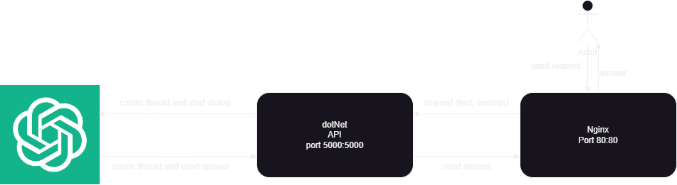

# GPT-Widget
## What is GPT-Widget?
GPT-Widget is a simple widget designed to integrate OpenAI's GPT assistant into any website. The widget helps users get information about products or services and can be customized for different tasks.

## Goal
The goal of the project is to provide an easy way to add a GPT assistant to a website using a frontend built with HTML, CSS, and JavaScript, and a backend built with ASP.NET Core.

## Setup Instructions
### 1. Clone the repository

  ``` bash
  git clone https://github.com/Yehor-Havrylenko/GPT-Widget.git
  cd GPT-Widget
  ```
### 2. Choose Your Deployment Method
1.[Setup Docker Compose](./Deployment/Docker/Setup.md) - For local deployment using Docker Compose.

2.[Setup Kubernetes](./Deployment/Kubernetes/Setup.md) - For deployment in a Kubernetes environment. If you don't have Kubernetes set up, [click here for Terraform setup instructions](./Infrastructure%20deployment/Kubernetes/terraform-setup.md).


